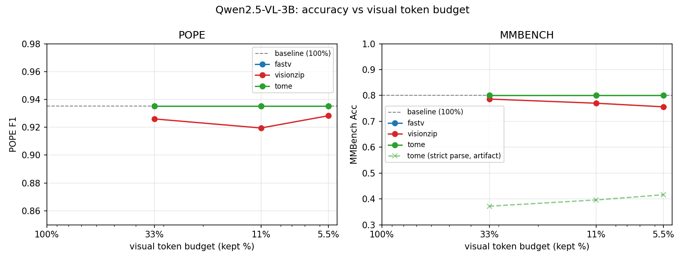
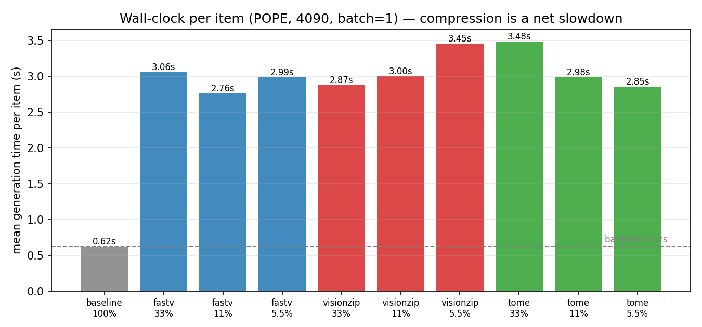

# VLM-Token-Compression


> 状态：**3B 全流程完成**（W1-W4）。Qwen2.5-VL-3B 上 baseline + FastV + VisionZip + ToMe-VLM 全量实测完毕（POPE 500 / MMBench 500，单卡 4090），结论图与 Gradio demo 已就绪。

## TL;DR

- 评测对象：Qwen2.5-VL-3B
- 方法：FastV、VisionZip、ToMe-VLM（自研迁移，training-free 视觉 token 压缩）
- 指标：任务精度（POPE / MMBench 子集）+ **真实延迟/显存**（非 FLOPs 代理）
- 核心发现（详见 Results 一节）：
  1. **VisionZip 是唯一"压缩真实生效"的方法**——编码器侧压缩改变 prefill 输入，精度随预算单调下降（MMBench 0.800 → 0.756）；
  2. **KV 侧方法（FastV / ToMe）对单 token 答案任务结构性免疫**——答案 token 来自未修改的 prefill logits，三个预算精度与 baseline 完全一致（500/500 首 token 相同）；
  3. **所有压缩方法实测都比 baseline 慢 4-6 倍**——理论 FLOPs 节省被 prefill 额外 attention 物化、KV 重建、逐条手动解码开销吞掉；
  4. **KV 修改会毒化多 token 生成**：FastV 退化为 role-marker 循环（`\n\nuser\n\nassistant\n...`），ToMe 的 post-RoPE 均值合并退化为字符粘连（`BFFBFF...`），后者直接破坏答案解析（MMBench 0.800 → 0.37）。

## Why

多数论文只报 FLOPs / MACs，但视觉 token 压缩在 decode 阶段收益有限、prefill 收益受 kernel 影响，**消费级 GPU 上 wall-clock 经常不降反升**——这是公开痛点，本仓库给出系统实测。

## Methods

| Method | 压缩位置 | 策略 | 来源 |
|---|---|---|---|
| FastV | LLM decoder 第 K 层 prefill 后 | 按 attention 分数剪视觉 token 的 KV | ECCV'24 |
| VisionZip | 视觉编码器输出 | 主导 token 选择 + 上下文合并 | CVPR'24 |
| ToMe-VLM | LLM 第 K 层 prefill 后 | 二分软匹配 + 多轮迭代合并视觉 KV（自研迁移，见 `src/methods/tome.py`） | NeurIPS'23 (ToMe) |
| CROP-R | MLLM | 细粒度冗余抑制（re-weight + prune） | arXiv'25（未实现） |

## Data

| Benchmark | 来源 | 说明 |
|---|---|---|
| POPE | **本地 COCO2017 自建**（val2017 + instances json，random/popular/adversarial 三策略） | 官方 POPE 基于 val2014，此处重建为 val2017 版本 |
| MMBench | 官方 dev TSV（[下载](https://download.openmmlab.com/mmclassification/datasets/mmbench/mmbench_dev_20230712.tsv)） | 图片内嵌，抽 500 条 |
| GQA / TextVQA | TODO（Visual Genome / OpenImages 图片体量大，暂缓） | 恢复后补 OCR 失败案例分析 |

复现：`python scripts/sample_benchmarks.py --coco-root /path/to/coco`



## Results（Qwen2.5-VL-3B，POPE 500 / MMBench 500，4090 单卡，eager attention，max_pixels=602112）

### 主表

| Method | Budget | POPE Acc | POPE F1 | MMBench Acc¹ | 平均生成时延² | Peak Mem |
|---|---|---|---|---|---|---|
| baseline (576 tok) | 100% | 0.938 | 0.935 | 0.800 | ~0.6 s | 7.7 GB |
| FastV | 33% | 0.938 | 0.935 | 0.800 | ~2.9 s | 7.7 GB |
| FastV | 11% | 0.938 | 0.935 | 0.800 | ~2.8 s | 7.7 GB |
| FastV | 5.5% | 0.938 | 0.935 | 0.800 | ~3.0 s | 7.7 GB |
| VisionZip | 33% | 0.930 | 0.926 | 0.786 | ~2.9 s | 7.7 GB |
| VisionZip | 11% | 0.924 | 0.919 | 0.770 | ~3.0 s | 7.7 GB |
| VisionZip | 5.5% | 0.932 | 0.928 | 0.756 | ~2.9 s | 7.7 GB |
| ToMe-VLM | 33% | 0.938 | 0.935 | 0.372 (0.800) | ~3.0 s | 7.7 GB |
| ToMe-VLM | 11% | 0.938 | 0.935 | 0.396 (0.800) | ~3.0 s | 7.7 GB |
| ToMe-VLM | 5.5% | 0.938 | 0.935 | 0.416 (0.800) | ~2.9 s | 7.7 GB |

¹ 括号内为按首字母解析的准确率；括号外为仓库标准解析（`\b([A-D])\b` 找独立字母）。
² 全部为逐条 generate 的端到端均值（含压缩开销），非分阶段计时。

### 发现 1：压缩位置决定"精度是否可动"

- **编码器侧（VisionZip）**：压缩发生在 prefill 之前，视觉信息真正丢失 → 精度随预算单调退化（MMBench 0.800 → 0.786 → 0.770 → 0.756）。这是三种方法里唯一"预算真正起作用"的。
- **KV 侧（FastV / ToMe）**：prefill 完成后才剪/合并 KV，而 POPE（yes/no）与 MMBench（选项字母）的答案都由**未修改的 prefill logits 的第一个 token** 决定。实测三个预算 × 两个榜，**首 token 与 baseline 500/500 完全一致**——KV 侧压缩对这类单 token 答案基准的精度是结构性免疫的，不是方法好，是评测结构撞上了实现位置。要让 KV 侧方法"可见"，需要多 token 答案的任务（如 TextVQA、POPE 解释版 prompt）。

### 发现 2：理论加速 ≠ 实测加速（反直觉但真实）

所有压缩方法比 baseline **慢 4-6 倍**（0.6s → 2.8-3.5s/条）。原因分解：

1. FastV 为取 attention 分数需 `output_attentions=True`，物化全部 36 层 attention（patch 后仅目标层，仍有开销）；
2. ToMe hook k_proj + 逐条计算 576×576 余弦相似度 + 多轮二分匹配；
3. 两者的 KV 重建（新建 DynamicCache + 逐层 gather/clone）与手动解码循环无法走 fused 的 `generate` 路径；
4. 收益端（decode KV 变小）在 32 token 短生成、batch=1 的 4090 上几乎可忽略。

**结论：在消费级 GPU + 短生成场景，training-free token 压缩的 wall-clock 是净亏损。** 论文报的 FLOPs 节省不可迁移。

### 发现 3：KV 修改毒化多 token 生成（失败案例）

虽然首 token 精度免疫，但解码后续 token 用的是被修改的 KV cache，生成质量崩坏，且两种方式崩法不同：

- **FastV（剪枝）**：回复退化为 role-marker 循环，如 `D\n\nuser\n\nassistant\nD\n\nuser...`——独立字母仍在，标准解析 `\b([A-D])\b` 恰好能取到正确首字母，精度"侥幸"无损；
- **ToMe（均值合并）**：post-RoPE 旋转后的 key 直接取均值，不同位置的旋转向量互相抵消，KV 方向/模长失真更严重，回复退化为字符粘连，如 `BFFBFFBFF...`、`Yesyesyes...`——解析器找不到独立字母，MMBench 报出 0.372-0.416 的"假崩"（按首字母解析实为 0.800）；
- 三个 budget 的 0.372/0.396/0.416 差异只是"退化文本可解析率"的噪声，不代表真实精度差异；
- 推论：**剪枝（丢弃信息）比平均合并（混合信息）对 KV 的破坏更小**——ToMe 论文在 ViT 上的 token 合并优势不能直接搬到 LLM KV cache（ViT 合并发生在 attention 前、有位置重编码，LLM KV 合并面对的是已烘焙 RoPE 的静态缓存）。



图由 `python scripts/make_figures.py --out results` 生成。左图：FastV/ToMe 曲线与 baseline 重合即"结构性免疫"的直观呈现（ToMe 虚线为标准解析的假崩口径）；下图：所有压缩配置实测时延均为 baseline 的 4-6 倍。

### 复现

```bash
# baseline / 各方法（每组约 25-30 分钟，单卡串行）
python -m src.eval.runner --method baseline --benchmarks pope,mmbench --out results
python -m src.eval.runner --method fastv --budget 0.33 --benchmarks pope,mmbench --out results
python -m src.eval.runner --method visionzip --budget 0.33 --benchmarks pope,mmbench --out results
python -m src.eval.runner --method tome --budget 0.33 --benchmarks pope,mmbench --out results
```


## 仓库结构

```
src/
  methods/        fastv.py / visionzip.py / tome.py / base.py（接口）
  eval/           runner.py（三重循环主入口）+ benchmarks/ + metrics.py
  models/         loader.py + hooks/（attention 探针、token 剪枝）
  profiling/      wallclock.py + memory.py（端到端计时、峰值显存）
scripts/
  sample_benchmarks.py   从 COCO/TSV 构建评测子集
  check_env.py           W1 自检（推理、token 数、attention hook）
  make_figures.py        结论图（accuracy_vs_budget / latency）
  demo.py                Gradio demo（方法×预算对比，实时显存/token 统计）
configs/          qwen25vl_3b.yaml（7B 配置待加）
results/          20 组 json（preds/逐条耗时/scores）+ figures/
```

## Demo

`python scripts/demo.py` → http://127.0.0.1:7860。上传图片 + 选方法/预算，实时对比回答、耗时、峰值显存与 kept/merged token 数。**预期行为**（发现 1/3 的直观呈现）：开放式描述下压缩方法会随图退化（这是特性不是 bug）；yes/no 问题下单 token 答案与 baseline 完全一致。

## 文献脉络：ViT Token 选择 → VLM Token 压缩

（面试/讲述用主线）DynamicViT / EViT / NAP / MAT / ToMe / FasterViT / LVTP / MPM 等在纯分类 ViT 上做 token 剪枝/合并；FastV 本质是 DynamicViT 的 decoder 版（用 [CLS]→最后文本 token 的 attention 替代）。本仓库把这条线统一放到 VLM 评测下检验。

## Quick Start

```bash
pip install -r requirements.txt
python scripts/check_env.py          # W1 自检：推理 + token 数 + attention hook
python scripts/run_baseline.py       # 无压缩基线
python scripts/make_figures.py       # W4 结论图（需先有 results/*.json）
python scripts/demo.py               # W4 Gradio demo，浏览器开 http://127.0.0.1:7860
```

